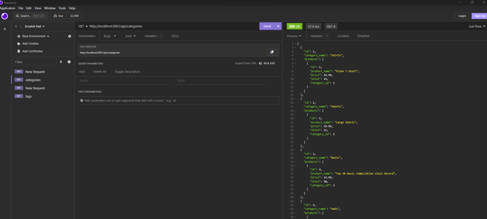
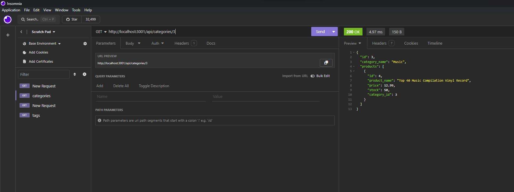

# E-commerce Back End Starter Code


# Description 

This is a simple buliding the  back end for an e-commerce site. Start code has been prrovided. The goal is to configure a working with Express.js API to use Sequelize to interact with Mysql database.

# Table of Contents
- Installation
- Usage
- Credits
- License
- Contributing
- Tests
- Questions

#  Installation

```
npm i
```


link to the repository : https://github.com/KittiyaLooknam/E-commerce-Back-End.git

# Usage

```
mysql -u root -p 
```
when prompted type in your MySQL password
```
source ./db/schema.sql
Quit;
npm run seed
npm start
```

Testing of the code was completed in Insomnia

```
Link to the video Demo  : https://youtu.be/dhafphDCSQM
```

## Features
* Express.js
* MySQL
* Sequelize








# Credits 
Thank you Mohit Dhankher and Louis Delia Tech Bootcamp Coding

# References 

# License
This project is licensed under the MIT license.

# Questions 
If you have any questions about this repo, please feel free to contact me at my email : kittya.goldberg1@gmail.com and Github profile : KittiyaLooknam


